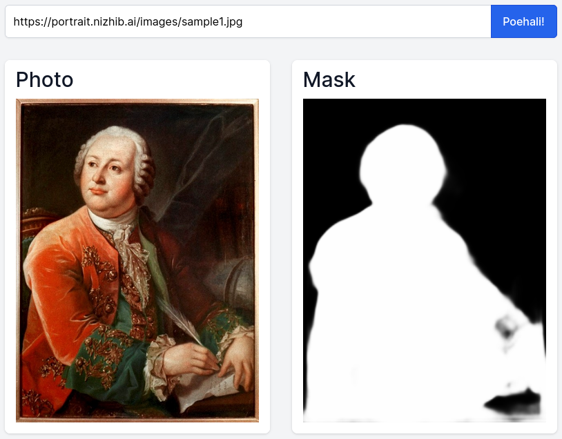

This demo was originally built for [picsart.ai](https://www.picsart.ai/) hackathon.

## Requirements

* Download `unet-resnext50` weights using a source link under `back/resource`.

## Running

Use docker-compose to fire backend + frontend + proxy:

* `docker-compose up`

## References

* https://pytorch.org/
* https://vuejs.org/
* https://bulma.io/
* https://traefik.io/
* https://docs.docker.com/compose/
